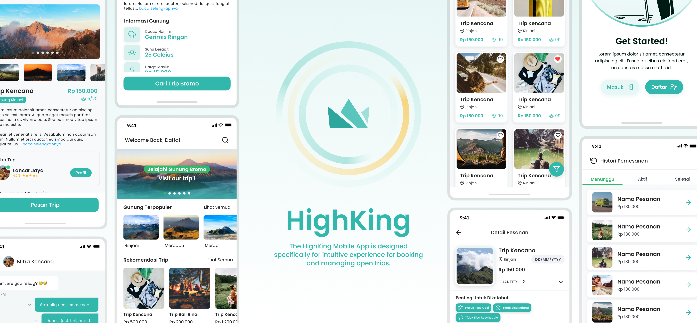

<h1 align="center">
  HighKing App
</h1>
<h2 align="center>
  Booking Hiking Trip in Indonesia  
</h2>
<h3 align="center">
  Bangkit 2024 Capstone Team: ENTS-H104
</h3>

#### Members
| Name                             | ID           | Path  | Role           | Kampus                               | Github                                                     |
| -------------------------------- |:------------:|:-----:| :------------: | :----------------------------------: |:----------------------------------------------------------:|
| LUQMANUL HAKIEM                  | A562D4KY4030 | MD    | Project Manager| Universitas Islam Madura             | [hyelqi](https://github.com/luqmanulhakiem/luqmanulhakiem) |
| Muhammad Daffa` Ashdaqfillah     | A004D4KY3753 | MD    | Member         | Institut Teknologi Sepuluh Nopember  | [daf2a](https://github.com/daf2a)                                                          |
| Nadya Zuhria Amana               | M004D4KX2486 | ML    | Contact Person | Institut Teknologi Sepuluh Nopember  | [nadyaza](https://github.com/nadyaza)                                                           |
| Aprilia Dela Safitri             | M004D4KX2085 | ML    | Member         | Institut Teknologi Sepuluh Nopember  | [apriliadesa](https://github.com/apriliadesa)              |
| Sulthan Akmal Rafliansyah        | M004D4KY2372 | ML    | Member         | Institut Teknologi Sepuluh Nopember  | [SulthanRaflyy](https://github.com/SulthanRaflyy)          |
| Yohannes Alexander Agusti Sinaga | C180D4KY1042 | CC    | Member         | Universitas Airlangga                | [Yohannes-Alexander](https://github.com/Yohannes-Alexander)  |
| David Dwiyanto                   | C345D4KY1102 | CC    | Member         | Universitas 17 Agustus 1945 Surabaya | [daviddvsjrgg](https://github.com/daviddvsjrgg)                      |

#### HighKing App Preview

#### Repository
- [HighKing Mobile App](https://github.com/ENTS-H104/highking-mobile-app)
- [HighKing Partners Web App](https://github.com/ENTS-H104/highking-partners-web)
- [Backend Service](https://github.com/ENTS-H104/backend) 
- [Machine Learning Model](https://github.com/ENTS-H104/ML)

#### Project Documentation
- **Demo Mobile Application Video:** [Watch Here](https://youtu.be/kNEz4Ca6-c0?si=rWz-c-ujyC4E226f)
- **Figma (UI Design):** [View Design](https://www.figma.com/design/rwqQOpgr353XAGuA1HvHls/PegiMuncak-App-Design-Client-Side?node-id=119-94&t=G8zHvYAljDHvl8LJ-1)
- **Documentation Website Application (Screenshot):** [View Screenshot](https://regal-flannel-91c.notion.site/HighKing-Web-Application-35275c2ffffa41a8af11d8a4bd6fa65b?pvs=4)

#### Dataset
- **Link:** [Access Dataset](https://drive.google.com/drive/folders/1t3FtZUQO64jpuS5xTbVBqWiIcK7hLpMj)

#### Deployment
- **Mobile Application (user) APK Release:** [Download APK v1.0.0](https://github.com/ENTS-H104/highking-mobile-app/releases/tag/v1.0.0)
- **Website Application (mitra and admin side):** [Visit Website](https://mitra.highking.cloud/)
- **API Documentation:** [View API Docs](https://documenter.getpostman.com/view/10569515/2sA3QqfY3J)
